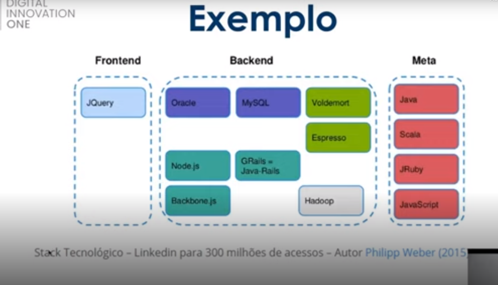
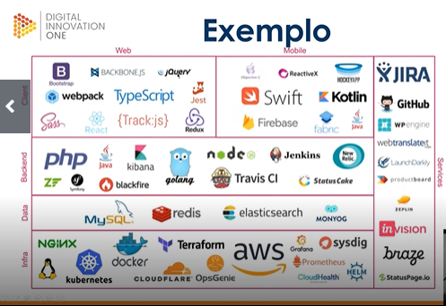
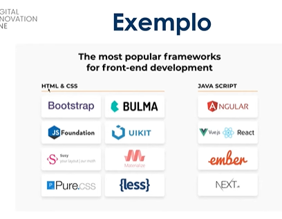

# **📒 ÓRBI WEB GAMES DEVELOPER - ANOTAÇÕES**
# Pensamento Computacional
Pensamento computacional pode ser aplicado tanto em humanas quanto em exatas.

##   **Visão Geral do Pensamento Computacional:**

###   Visão Geral (Overview):
> Conceito:
- Processo de pensamento estruturado que envolve a determinação de um problema  e de uma solução para o mesmo, de forma que haja uma sucessão de  instruções (passo a passo) executadas através de um algorítmo
- Formulação e resolução de problemas
- Sistemático e eficiente (homem e máquina precisam entender todo o processo)

> Pilares do Pensamento Computacional:
- **Decomposição:** Problema complexo é divido em pequenos problemas a fim de diminuir sua complexidade. Consiste em dividir o problema em pequenos quebra-cabeças e sair resolvendo os problemas um a um.
- **Reconhecimento de Padrões:** Reconhecer similaridades e diferenças entre os problemas. Isso tem a ver com padrão comportamental (p.ex: se a bolsa de valores cai/sobe, a maioria dos investidores vendem/compram suas ações).
- **Abstração:** Extrapolar o conceito do problema para uma forma generalista. Tornar o geral em particular (lembrar de POO)
- **Automatizar:** Definir passo a passo a solução do problema. Criar um algorítmo
- Refinamento > Teste > Análise
- _Homem_: Resolução de problemas (abstração) e expressão de solução (automatização) - _Recursos Computacionais:_ Executam a solução proposta pelo homem e avaliam (refinam) ela.
- Raciocínio Lógico
- Refinamento constante das soluções
- Pode ser usado na: 
a. Química, b. Engenharia, c. Biologia, d. Computação
> **Resultados**:
- Pensamento sistemático
- Colaboração dentro da equipe
- Criatividade e Design
- Facilitador

###  Habilidades Complementares
> Raciocínio Lógico
- Pensamento estruturado que guia a uma determinada solução
> Classificação do RL:
- **Indução:** Levar problema para o campo das ideias para determinar padrões, teorias, etc
- **Dedução:** Depois de determinar ideias, teorias e leis, chego a uma explicação
- **Abdução:** Conclusão com base na premissa da dedução (diagnósticos, processo investigativo)
-  **Inferência:** Sintética (embasa a abdução e a indução) ou Analítica (embasa a dedução)
> Aperfeiçoamento:
- Soluções eficientes
- Otmização de processos
- Simplificar linhas de código
- Funções bem definidas
- Processo contínuo
- Presente em todas as etapas do projeto

##   **Pilares do Pensamento Computacional:**

###  1 - Decomposição
_Quebrar o problema em diversas partes_

> Fases da Decomposição:
- Análise: decompor os elementos
- Síntese: Combinar elementos recompondo o problema original. Fundir elementos de maneira coerente
- Ordem da decomposição: Sequêncial: um depois do outro | Paralelo: tarefas executadas de maneira conconmitante.

###   2 - Reconhecimento de Padrões:
> Modelo Base (modelo de referência)

> Estrutura Variante

> Repetição

> Exemplo: Compressão de Dados

Porque determinar padrões?
- É uma forma de generalizar algo a fim de poder usar de outras formas.
- O ser humano padroniza por similaridades (gtupos conhecidos x objeto desconhecido)

> Como o computador reconhece padrões?
- Representação do Atributo
- Aprendizado - Conceito associado ao objeto (o que significa ser fruta)
- Armazenar dados do atributo (contexto, etc)
- Regras de Decisão (baseado nos dados aprendidos, o computador toma decisões)

> Reconhecimento de padrões é usado em:
- Classificação de dados (arquivos, documentos, etc)
- Reconhecimento de imagem (placa de carro)
- Reconhecimento de fala (idioma)
- Análise de cenas (de filme ou outra mídia)
- Classificação de documentos

###   3 - Abstração:
> Conceitos:
- Abstrair: Observar diferentes elementos e avaliar as características de maneira individual
- Abstração: Isolamento de um objeto da realidade (realidade concreta, paupável). É generalizar um objeto existente do mundo real e tornar sua extensão mais ampla.
- Generalização: Na lógica, operação intelectual que reune numa classe geral um conjunto de seres ou fenômenos silimares

> Classificação dos Dados na Abstração:
- Caractererizar
- Observar pontos essenciais (peculiaridades, detalhes do objeto)
- Deixar de lado os detalhes e reunir os dados gerais (generalizar)

> Representação
- Resultado da abstração

> Exemplo - Estudante:
- Nome
- Matrícula
- Endereço
- Campus
- ...

Todos os dados acima são características principais e essenciais. Dados como trabalho, se tem filhos ou qual o programa preferido do estudante são dados triviais e dispensáveis à astração.

> Conceitos Baseados em Anstração:
- Algorítmos
- Estrutura de Dados
- Máquinas de Estado
- Linguagens de Programação
- Redes de comunicação (síncrona, assíncrona ou paralela)
- Arquiteturas de Internet (Cliente X Servidor, Camada, Ponto a Ponto, Estrela, etc.)
- etc.

###   4 - Algorítmos:
 
Encontrar soluções de forma mais eficiênte!
 
 > Computador:
 - Energia grande
 - Trabalhador
 - Eficiente
 - Rápido

 
Porém o computador precisa de alguém (desenvolvedores) para passar as instruções para ele poder executar solções de problemas.

 
 O algorítmo procede de um processo de resolução de problemas "step by step" (passo a passo) utilizando instruções (o que precisa ser feito e a ordem de execução das instruções). Tal algorítmo precisa ser entendido pelos humanos e pela máquina.

 > Desenvolvimento de um Programa:
 - Análise: Dados de Entrada e Saída
 - Algorítmo: Descrição do problema
 - Codificação: O algorítmo é codificado de acordo com alguma linguagem de programação escolhida

> Em Resumo - Agorítmo é:
 - Uma sequência de passos com objetivo definido
 - Que executa tarefas específicas
 - Com um conjunto de operações para executar as tarefas e retornar um resultado

 > Aplicação de Algorítmos no dia-a-dia:
 - Preparar um sanduíche
 - Trocar uma lâmpada
 - Fazer um bolo
 - Escolher trajeto para o trabalho

 > Como Contruir Um Algorítmo?
 - Compreenda o problema
 - Defina os dados de entrada
 - Defina o processamento (cálculos, etc)
 - Defina dados de saída (resultados)
 - Utilize um método de construção
 - Faça testes de diagnóstico (refinar o algorítmo, corrigir erros)

 > Construção de Algorítmos:
 - **Narrativa:** usa linguagem natural para definir instruções passo-a-passo. Sem conceitos novos. A desvantagem é que pode acarretar em diferentes interpretações! Ambiguidade pode ser vista aqui
 - **Fluxograma:** Usa símbolos pré-definidos. Carrega conceitos prévios da estrutura e símbolos. É de simples entendimento
 -  **Pseudocódigo:** (Portugol) Parece com uma linguagem de programação, mas usa um pouco de linguagem natural. Tem regras bem definidas e com passo-a-passo

 
Obs: Nem sempre passaremos por todas as etapas da construção de um algorítmo. Podemos, por exemplo e dependendo do caso, pular a decomposição. 

##   **Estudo de Caso**

###   Estudo de Caso:
> Exemplo para construir o conceito: Perdido na Floresta. Você está perdido na floresta. Como sobreviver?
- Identificar mecanismos
- Recursos comuns
- Detalhes mais importantes

> Decomposição do Problema Original

 <strong>Sobrevivência :</strong>

- Água (chuva, nascente, fogo: ferver água para combater microorganismos nocivos)
- Comida (coletar, caçar, localização: mapa, fogo: conzinhar)
- Abrigo (localização, proteção, quente e seco, fogo: aquecer)

O fogo é o padrão. É um elemento essencial!

> Em seguida, vem o algorítmo:
- Pegar peixe
- Colocar água na panela
- Ferver água
- Limpar
- Fazer cozido
- Assar filé
- Encontrar água
- Construir abrigo
- Maximizar chances de resgate 

---
# Lógica de Programação Essencial

##   **1 - Introdução à Lógica e a Programação**

###   1 - Entendendo o Que é Lógica:
_Programar é  resolver problemas!_

> O que é lógica?
- Coerência de raciocínio, de ideias
- Sequência coerente, regular e necessária de acontecimentos, coisas
- É a escolha da melhor sequência de ações para solucionar um problema
- **Metacognição:**  "Pensar como você pensa"

###   2 - O Que São Algorítmos e Pseudocódigo

 

> Algoritmo: 
- Sequência de passos para revolver um problema
- [Site de lógica de programação para iniciantes com base em minecraft](https://studio.code.org/s/mc/lessons/1/levels/1)

> Pseudocódigo:
- Forma genérica de escrever um algorítmo. É usado somente para se aprender a lógica de programação.
- [Aprendendo pseudocódigo jogando! Clique aqui!](https://www.proprofsgames.com/wolf-sheep-and-cabbage/)

###   3 - Fluxogramas, Variáveis e Constantes
 
  

 > Fluxograma:
 - Serve para representar **graficamente** um algorítmo (fluxo de dados). É um tipo de diagrama que pode ser entendido como uma representação esquemática de um processo.
 - Os fluxogramas não possuem desenhos padrões definitivos. Pode-se encontrar diversos formatos deles por ai.
 
 > Variável:
 - Objeto ou posição frequentemente localizada na memória e capaz de reter e representar um valor ou expressão. É um espaço na memória do computador que tem seu valor alterado durante a execução do algorítmo.

 > Tipos de Variaveis/Constantes:
 - Numéricos (inteiro, real)
 - Caracteres (string)
 - Alfanuméricos (alfanum)
 - Lógicos (booleanos)

> Fluxograma:
- Declaração das variáveis/constantes
- Entrada dos dados
- Processamento dos dados recebidos
- Exibição do resultado
- [Programa para treinamento em fluxogramas (disponível apenas para windows até a escrita deste material)](http://flowgorithm.org/)

###   4 - Tomadas de Decisões e Expressões:

 

> Expressões Aritméticas:
- Armazenam operadores e funções aritméticos que envolvem constantes e variáveis
- **Operadores Aritméticos**

> Expressões Literais:
- Possuem constantes ou variáveis com resultado de **valores literais**. Um literal é um valor expresso como ele mesmo e não como o valor de uma variável ou o resultado de uma expressão, como o número 3 ou a cadeia de caracteres "Olá"([Fonte](https://learn.microsoft.com/pt-br/dotnet/visual-basic/programming-guide/language-features/constants-enums/constant-and-literal-data-types)). Literal tamnbém pode ser definido como uma notação que representa um **valor fixo** no código-fonte ([Fonte](https://pt.wikipedia.org/wiki/Literal_(programa%C3%A7%C3%A3o_de_computadores)))

 

> **📋 Conceito Conciso:**  Literais são notações que definem outros tipos de dados como numéricos, caracteres, alfanuméricos e lógicos. Portanto, parece-me muito que eles estão intimamente ligados aos tipos primitivos de dados (inteiro, real, string e booleano).

 

> Expressões Relacionais:
- Expressões compostas por outras ou variáveis numéricas com opeadores relacionais (> - >= - < - <= - == - !=)

 

> Tomadas de Decisão:
- Tomam boa parte da programação, por isso precisa ser entendida!

###   Concatenação

 

> O Que É?
 - Termo da computação

> Para que Serve?
- Une o conteúdo de duas strings
- Agrupa duas ou mais células que podem possuir fórmulas, textos ou outras informações, gerando um único resultado.

##   **2 - Introdução ao Portugol**

###    1 - Estruturas de Repetição

 

> Conceito
- Estrutura que permite exevutar mais de uma vez o mesmo comando ou conjunto de comandos mediante uma condição (if) ou um contador (iterador / incrementador). 

###    2 - O Que São Linguagens de Programação?

 

> Conceito:
- Escrita formal que especifica um conjunto de instruções e regras usadas para gerar programas (softwares)
- "_O que é óbvio para você, certamente não é óbvio para uma máquina. E se você quer que a máquina faça algo para você, você precisa 'falar com ela'_. "

 

> **Conceito Conciso:**
- Portanto, linguagem de programação é o meio pelo qual humanos e máquinas interagem mutuamente.

>Tipos
- Alto Nível: Sintaxe se aproxima mais da nossa linguagem e se distanciam mais da linguagem das máquinas.
- Baixo Nível: Se aproxima mais da linguagem de máquina. Necessário ter o conhecimento direto da arquitetura do computador para fazer alguma coisa.
- Compiladas: Usam um compilador (C#). Traduz seu código em linguagem de máquina por um processo chamado de compilação e é executado diretamente pelo SO.
 - Interpretadas: Código-fonte é executado por um programa chamado de interpretador e em seguida é executado pelo SO ou processador (JS, Python, PHP, etc.)

> Portugol:
- Pseudolinguagem que trabalha a resolução de problemas lógicos em si e não nas ferramentas para solucioná-los.

 

---
# Projetos Ágeis Com SCRUM

##   **1 - Introdução ao SCRUM**

 

### 1 - Introdução a Gestão de Projetos a ao SCRUM
 

> Conceitos Básicos:
- Dos objetivos de negócios de uma empresa é que nascem os requisitos no desenvolvimento de um projeto.
- Desperdício de software: Empresas chegam a não usar os programas desenvolvidos pelos profissionais. Esse desperdício tem a ver com a gestão do projeto

 

> Modelos de Gestão de Projetos:

|Tradicional (Waterfall)|Ágil (SCRUM)|
------------|----|
Só avança para a próxima quando uma fase está inteiramente completa.|O SF é construído em partes (incremental)
Parte burocrática é um problema no andamento e finalização do projeto.|Cada parte é executada em um ciclo (um mês mais ou menos para cada parte).
Escopo definido na fase inicial.|Escopo definido ao longo do projeto.
Projeto é controlado por fases e marcos.|Projeto é controlado pela entrega de funcionalidades.
Cliente só vê SW funcionando na parte final.| Cliente pode ver o SW funcionando na parte inicial
Há resistência à mudanças.| Mudanças constantes de acordo com feedbacks constínuos.

> O que é Ser Hágil?
- Não é ser rápido em essência, mas ser rápido na mudança e no desembaraço. 
- É velocidade na adaptação.
- Fazer o complexo de forma simples (fatiar os problemas)
- Equipe comprometida com os objetivos.
- É foco no cliente e não no projeto

> O Que é SCRUM?
- Um dos frameworks de gerenciamento de projetos ágeis (baseado no esporte HUGBI).
- Projetos usando equipes pequenas e multidisciplinares gerando maiores resultados.

> Pilares do SCRUM:
- Conversar mais escrever menos (TRANSPARÊNCIA)
- Demonstrar o SW constantemente aos usuários e receber feedbacks constantes (TRANSPARÊNCIA)
- Requisitos mudam ao longo do tempo (ADAPTAÇÃO)
- Aprender progressivamente com o uso do SW (INSPEÇÃO)

> Razões para Adotar SCRUM:
- Desenvolvido e entregue em partes menores (2 a 4 semanas)
- Melhor geenciamento de riscos (redução de incertezas)
- Comprometimento, motivação e transparência da equipe (Daily Meeting)
- Maior valor para o negócio (Priorização do Backlog)
- Usuários envolvidos durante todo o ciclo
- Aplicação das Lições Aprendidas (melhoria contínua)

> Por que Startups Usam?
- Por causa do **Minimum Viable Product (MVP)**: Uso mínimo do SW para que o cliente veja o que realmente quer e dê seu feeedback

 

### 2 - Papeis e Responsabilidades de cada Membro SCRUM:

  

> Product Owner (PO)
- Representa a área de negócios
- Não é um comitê
- Define funcionalidades do SW (Product Backlog)
- Prioriza as funcionlidades de acordo com o valor do negócio
- Assegura que o time de devs entenda os itens do Backlog no nível necessário

> Scrum Master:
- Garantir uso correto do SCRUM
- Não é gerente de projetos
- Age como facilitador
- Auxilia o Product Owner no planejamento e estimativas do Backlog
- Auxilia equipe a remover impedimentos
- Treina time de devs para autogerenciamento e interdisciplina

> Time de Devenvolvimento:
- Desenvolvem
- Testam
- Criam e Desenham

Isto é, fazem tudo em relação ao desenvolvimento.

 

### 3 - Cerimônias do SCRUM:
 

> Time Box:
- Tempo máximo para fazer uma cerimônia ou Sprint (corrida, arrancada).
- Sprint é o principal evento do SCRUM
- Quem define o tempo da Sprint é o próprio time

> Composição da Sprint:
- Planejamento da Sprint: PO participa junto com o SCRUM master e o time dev. O que fazer (4 horas para definir) - Como fazer (4 horas para definir). Planning Poker: opiniões sobre cada tarefa
- Reuniões Diárias (Daily Meeting): Stund Up Meeting. Conversa sobre o dia anterior e as tarefas de hoje. Dura cerca de 15 minutos
- Rvisão da Sprint (Review): Time dev apresenta ao PO o trabalho feito. Dura cerca de 4 horas.
- Retrospectiva da Sprint: Lições aprendidas. Transparência é regra aqui. Sinceridade. Dura cerca de 3 horas.

 

---
# Desenvolvimento Web: Primeiros Passos

## **1 - O Que é a Internet**

###   1 - Introdução ao Tema
 

> História
- 1969: Arpanet - Departamento de Defesa - Guerra Fria
- 1982: Universidades - Holanda, Dinamarca e Suécia
- 1987: Liberado uso comercial nos EUA
- 1992: CERN cria WWW. Dados acessíveis a qualquer pessoa com a internet

> Brasil
- 1988: FAPESP, UFRJ, LNCC trouxeram internet pra cá
- 1994: Uso comercial - EMBRATEL
- Conexão discada
- 2000: Banda Larga

###   2 - Termos-chave
 

- Download
- Navegador
- Banda Larga
- Cache (dados previamente salvos pelo browser)
- Crack (SW pirata)
- E-mail
- Emoticons/emoji
- gif/jpg/png
- Host (endereço)
- HTML
- HTTP
- Ícone
- Link (ligação. Não é a mesma coisa que URL!)
- Login/logon (são a mesma coisa)
- logout/logoff (são a mesma coisa)
- mp3
- multimídia
- Nick (apelido)
- Online/offline
- Pixel (pixar + element = pixel)
- Span (emails massivos enviados para várias pessoas)
- URL
- Vírus (SW malicioso)
- Keylogger (SW malicioso que grava todas as teclas pressionadas pelo usuário)
- Backup
- Blog (espécie de diário no início)
- Vlog (diário em forma de vídeo. Parente do blog)
- (Cyber) Bullyng (ameaças, afronta, chantagens on-line)
- 3G, 4G, 5G (velocidades da internet móvel)
- Cookies (pequenos registros de navegação do usuário usados pelos algorítmos de vendas)
- Firewall
- Hacker
- IP
- Phishing (roubo de dados mediante click)
- Click Bait (roubo de dados mediante click)
- Fake News
- Podcast (espécie de rádio na internet)
- Pop-up (janelas invasivas e irritantes)
- Youtuber (produtor de conteúdo dessa plataforma)

###   3 - A Internet Atual
 

> Números
- 134 mi de brasileiros com acesso a internet (75%)
- Mulheres: 74% / Homens; 73%
- Há 10 anos somente 41%
- Área Urbana: 77% / Rural: 53%
- 97% de pessoas com Ensino Superior acessam
- ...

## **2 - Como Funciona a Internet**

###   O que São Redes:

> Backbone:
 - Espinha dorsal da internet
 - Estrutura parruda
 - Semelhante a costelas

> Provedores de Serviço:
- Empresas telefônicas
- Contratam o backbone e repassam para nós ou outras empresas
- Dial-up
- ADSL (banda larga)
- Fibra ótica
- Rádio
- Satélite
- Móvel
- P2P (peer to peer)

> Caminho Inverso Até Chegar na Nossa Casa:
- WWW
- DNS
- IP
- Classes de Redes
- 127.0.0.1 (local host)

 _Obs:_ Latência é o tempo que um determinado dado leva para sair de um local de origem até outro local de destino.

 

## **3 - TCP/IP - Portas - Roteadores - Switches - Modems**

###   1 - TCP/IP e UDP:
 

> TCP:
- Protocolo de Controle de Transmissão
- Usa modelos de camdas

> Etapas da Transmissão:
- Física (ex: placa de rede)
- Rede (ex: IP)
- Transporte (ex: TCP, UDP)
- Aplicação (ex: FTP, SMTP, HTTP)

> TCP:
- Mais lento que o UDP
- Handshake: Confirmação de recebimento de pacote de dados entre dispositivos/softwares
- Integridade nos dados
- Ordem nos dados
- Aplicativo de mensagens de texto

> UDP:
- Rápido
- Não confiável
- Carro do ovo (carro divulga a informação da venda do ovo, mas não sabe se todos estão ouvindo ela!)
- Livestream
- Sai mandando informação de maneira adoidada sem saber se todo mundo recebeu
- Usado em lives por causa da rapidez

###   2 - Portas (Erro de Tradução):
 

> As portinhas por onde os dados sairão e chegarão:
- FTP: 20
- SSH: 22
- SMTP: 25
- DNS: 53
- HTTP: 80
- HTTPS: 443

###   3 - Portas (Erro de Tradução):
 

> Modem:
- Modulator / demodulator: modula e demodula sinais
- Converte dados de um computador para o outro

> Roteador:
- Distribui internet para um ou mais dispositivos de uma rede
- Pode fazer comunicação entre redes
- Não filtra dados enviados/recebidos (os mais antigos, os modernos não)

> Switch:
- Distribui a internet para um ou mais dispositivos de uma rede de forma mais inteligente que os roteadores tradcicionais, verificando qual dispositivo deseja receber certos tipos de dados ou não;

## **4 - Celulares, Internet e Outros Dispositivos**

###   1 - Dados Móveis:
 

> SMS:
- Tudpo começou com o SMS
- Quanto custa para uma empresa enviar um SMS? Nada!
- Troca de pacotes

> MMS:
- Transmissão de mensagens multimida (audio + video)
- Conexão de dados primitiva

> Conexões Móveis:
- 1G (analógico) - 10 Kbps
- 2G (digital - GSM: Global System for Mobile Comumunication): 97 Kbps
- 2.5G (GPRS)
- 2.75 (EDGE)
3G (7Mbps)
- 4G (22,1Mbps)
- 5G (10Gbps)

###   2 - Wi-Fi:
 

> Empresa IEEE (ou I3E)
- IEEE 802.11
- . . .(vide aula)

> Segurança
- WEP
- WPA
- WPA2 (AES): + Segurança e + processamento. Mais lento, porém, mais seguro hoje.

> Dispositivos de Rede:
- Impressora
- Scanner
- Chromecast

###   3 - Bluetooth:
 

- Conexão ponto-a-ponto, sem dependencia da internet.

 

## **5 - Browser, Sites, Aplicativos e Webserver**

###   1 - Browser:
 

> Características:
- Identifica diversas linguagens de programação, de marcação e conteúdo multimídia.
- Possuem plug-ins ou add-ons para ajudar na navegação
- Usam chache e cookies (rastreadores de preferências para vendas)

> Páginas - Interação Com Elementos:
- Estáticas
- Dinâmicas: Partes independentes. Maior interação
- [Versões antigas de vários sites famosos](https://archive.org/web/)

###   2 - Sites, Aplicativos e E-Commerce:
 

> Site
- D/XHTML: "D" de dinamic. Caindo em desuso

> Aplicativo:
- SW executado no seu navegador
- Um aplicativo nada mais é do que uma espécie de navegador
- Hoje quase não existe diferença entre site e aplicativo
- Diferença entre programa/software e aplicativo

> E-Commecer:
- Comércio eletrônico com sistema de pagamento que pode ser exterior ao site (Pic Pay, Boleto, PagSeguro, PayPal, etc.)

###   3 - Web-Server:
 

> Conceito:
- Loca onde ficam guardados nossos dados

> Tipos:
- **Estático:** Servidor físico onde são armazenados arquivos, SW e/ou BD. Possumem resistância de dados
- **Dinâmico:** SW que estão presents no servidor físico.

> Mas o Que É Web-Service?
- Interface para fazer requisições e consultas em BDs inacessíveis (Correios, Governo)

 

##  **6 - O Que São Stacks**
 

### 1 - Stacks:

 

> Conceito:
- Pilhas de tecnologia
- Conjunto de SW necessários e suficientes para executar um aplicativo/programa
- Envolve linguans de programação
- Todo o ambiente tecnológico com todas as ferramentas e funcionalidades para operarar com apps/sw
- Capacidade e limitação de performance
- Define pontos fortes e fracos dos apps/sws

 

> Importância:
- Informações das equipes de projetos
- Saber as limitações e capacidades das ferramentas e ambientes têm disponíveis
- Sistemas, BDs, LP e protocolos de comunicação
- Estratégias de negócios
- Contratações, planos de mitigações de riscos, aumento de capacidade, uso dos dados (velocidade de transferência)

### 2 - Back-End, Front-End e Fullstack:

 

> Front-End:
- "Parte da Frente"
- Site, SW, app, web service
- Interface, UI, UX
- Lógica de Programação, HTML, CSS, JQuery/JS/AJAX, PHP, Bootstrap, etc.

 

> Back-End
- Parte de Trás
- Servidores
- Bando de Dados
- Meio-de-Campo entre interface e BD
- Regras de negócios
- Validações
- MySQL
- Oracle
- Protocolos de comunicação
- PHP
- Java
- Node.JS

 

> Fullstack
- Trabalha em todas as camadas das tecnologias de desenvolvimento/execução de um app/sw

 

> Exemplos:

 
 

 
 

 

##  **7 - Linguagens de Programação (LPs) e Termos**
 

### 1 - Principais LPs:

 

- HTML
- CSS
- JS - JQuery - AJAX (consulta muito rápida em BDs) - diversas libs
- PHP (manipulação de dados)
- .NET
- ASP
- Java 
- Ruby (on Rails)
- Python
- Perl
- C - C++ - C# (as duas últimas orientadas a objeto) - São mais de baixo nível.

### 2 - Termos Comuns - Parte 1:

 

- 404 (endereço inexistente)
- Algorítmo
- ALT (texto alternativo que é mostrado pelo cursor do mouse quand encima de um objeto)
- API (parte de SW sendo usado dentro de outro SW)
- Aplicação
- Back-End
- Biblioteca/dll
- Bootstrap - Um dos frameworks de Java mais usado hoje em dia
- Breakpoints - Pontos chave para determinar tamanho da tela em dispositivos móveis OU pontos de parada na execução do DEBUG
- Browser/navegador
- Cache
- Bug
- Código - Instruções de funcionamento ou interpretação para a execução ou compilação de um app/sw
- Controle de Versão
- Cookies
- DEGUB
- Deploy
- Design adaptativo/Responsividade
- DNS
- Documentação - Interna (dentro do código) - Externa (manual do usuário)
- Domínio
- DPI - Proporção de pontos na tela - Quantos mais pontos na tela maior será a resolução.
- Editor de Texto
- Estrutura de Dados - Pilha, Fila, Array, Char, Integer
- Favicon
- Fontes - Com serifa, sem serifa
- Framework - Caixa de ferramenta para desenvolvimento de a´´/sw
- Front-End
- FTP - Protocolo de comunivação quase que exclusivamente para troca de arquivos
- Full-Stack
- Github/SVN/CVS - - Mais famosos controladores de versão da atualidade

 

### 2 - Termos Comuns - Parte 2:

 

- Linguagem
- Meta Tags
- Métodos Ágil
- Mobile
- MVC - Mobile View Controler
- MVP - Minimal Viable Product: Mínimo recurso de um app/sw disponibilizado ao cliente para realizar testes
- MySQL
- Pixel
- Resolução -  Quantidade de pixel na tela
- Servidor
- Sistema Operacional (SO)
-  Solução - Um programa ou um conjunto de programas fornecidos ao cliente
- SSL - Camada de segurança dos sites
- UI - User Interface
- UX - User Experience: como o usuário lida com o meu programa
- Versão - Número que vem ANTES do ponto são mudanças grandes, os que vêm DEPOIS do ponto são mudanças pequenas (será isso mesmo?).
- WYSIWYG - What you see is what you get - O que você vê é o que você obtém. Pequenos editores de texto em sites que permitem alterações visuais e piblicação do texto com estas exatas alterações.
