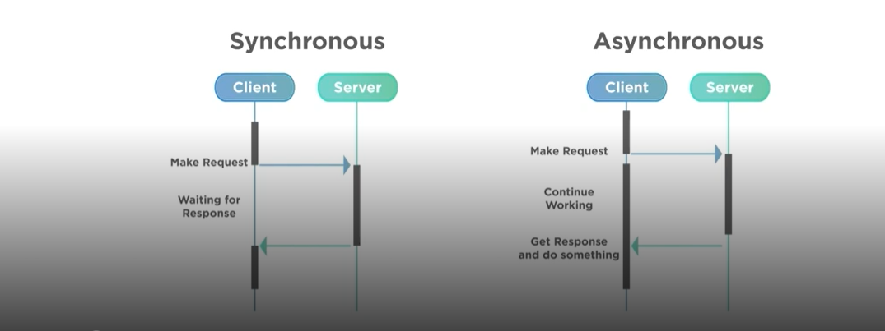
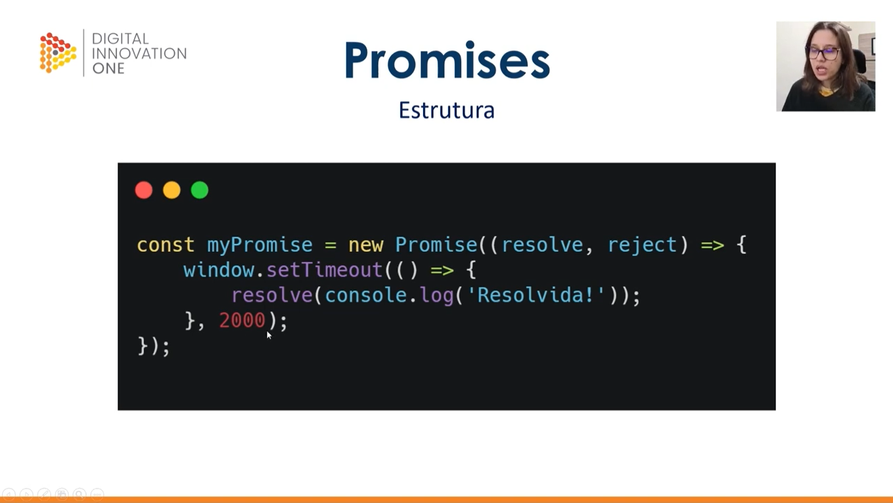
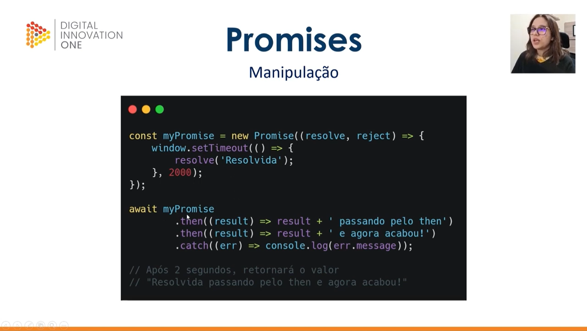
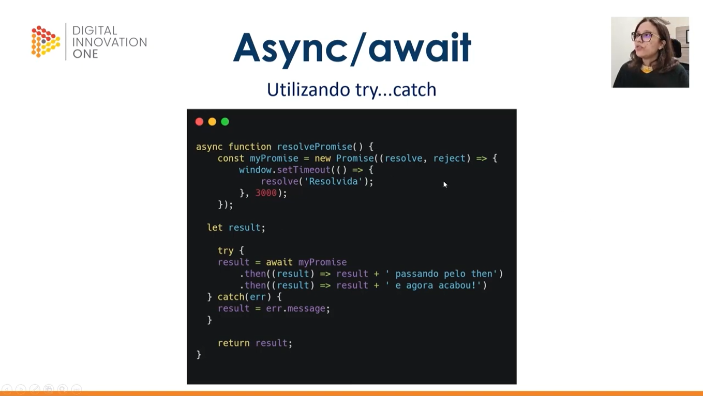
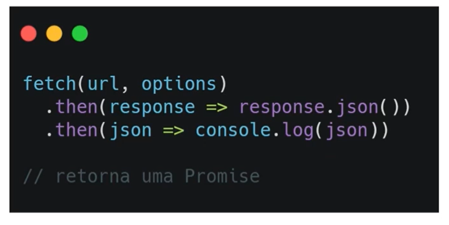

# Assincronidade

## **Promises, Async e Wayt**
 

 > Assíncrono x Síncrono:
 - **Assíncrono:** Que não se efetiva ao mesmo tempo. Uma atividade pode ser feita em um tempo diferente da outra e não exatamente no mesmo tempo.
 - **O JS roda de maneira síncrona por padrão (uma coisa depois da outra).**

  

 

 > Promisses:
 - Objeto de processamento assícrono
 - Iniclamente, seu valor é desconhecido
 - Pode ser resolvida ou rejeitada
 - É literalmente uma promessa

 > Estados da Promise:
 - **Pending:** Pendente. A promise foi criada e a função assíncrona á qual ela está associada não foi concluída ou falhou ainda. Espécie de estado intermediário de expectação 
 ([Fonte](https://developer.mozilla.org/pt-BR/docs/Learn/JavaScript/Asynchronous/Promises)).
 - **Fulfilled:** Completado
 - **Rejected:** Rejeitado (deu errado)
 
 

 > Estrutura da Promisse:
  

- Depois de dois segundos, a myPromise apresentará como resultado bem sucedido(**resolve**) a mensagem 'Resolvida' no console

 

> Manipulação / Encadeamento de Promises:
 

- Com o **THEN** e o **AWAIT**, o conteúdo  da myPromise só será executado caso a promessa seja bem sucedida
- O **RESULT** representa o resultado da myPromise sendo pego para realizar determinada operação
- O THEN pode aparecer mais de uma vez dependente da quantidade de operações que se deseja fazer
- **CATCH** aqui serve para mostrar uma mensagem de erro caso a promise apresente como resultado o **Rejected**.
- Caso a promisse seja bem sucedida (**resolve**), a mensagem 'Resolvida' passará pelo primeiro THEN, que concatenará a mesma com outra a string ' passando pelo then'
- Em seguida, com os resultados acumulados, a mesma mensagem seguirá agora para o segundo THEN que irá concatenar mais uma string, isto é, a ' e agora acabou!'

> Async x Await:
- Necessário usar estas duas palavras para usar funções assíncronas!
- **Necessário Async para usar o await**

 

> Try e Catch nas Promisses:

 

 

# Consumindo API

## **APIs e Fetch**
 

> API:
- Appplication Programmiing Interface
- Forma de intermediar os resultados do back-end com o que é apresentado no front-end
- Acessada por URLs
- Formato .JSON (JavaScript Object Notation)

 

> Método Fetch:
 

- Possível fazer operações:
  - Post
  - Get
  - Put
  - Delete
  - etc

- **O FETCH retorna uma promisse e por isso precisa ser usado com o AWAIT**

 

# Atividade: API "catAPI"

Nesta atividade, vamos criar uma página que carrega fotos aleatórias de gatinhos sempre que clicamos em um botão.

1- Utilize a [API](https://thatcopy.pw/catapi/rest) para fazer as chamadas com o método **fetch()**;
 

2 - Utilize seus conhecimentos na manipulação do DOM para criar a imagem e ativar o evento de clique do botão!