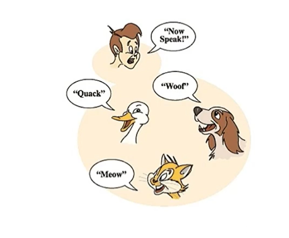
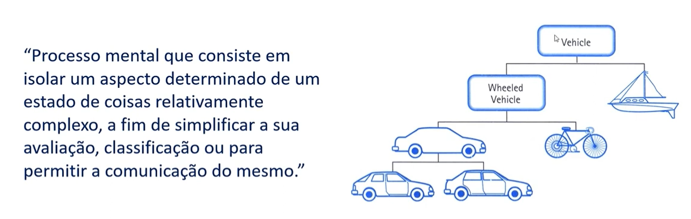

# Compreendendo a Orientação a Objetos
 

## Paradigmas e Pilares:
 

> Paradigmas da Programaçaõ:
- Formas de Programar
- Imperativo: **COMO** resolver os problemas
- Declarativo: **O QUE** fazer para resolver o problema

 

*Programas são objetos com diversas propriedades*

 

> Pilapres da POO:
- **Herança:** Objetos filhos herdam atributos e métodos do Objeto pai, apesar de ter suas próprias características e funcionalidades
- **Polimorfismo:** Objetos podem herdar a mesma classe pai, mas se comportam de maneira diferente na invocação de seus métodos:

 

 
- **Encapsulamento:** Cada classe tem propriedades e métodos independentes do restante do código
- **Abstração:** Processo mental de isolar um aspecto determinado de um estado de coisas relativamente complexo a fim de simplificar a sua avaliação, classificação ou para permitir a comunicação do mesmo.
- É tornar algo complexo em algo simples

 

# Orientação a Objetvos em JS
 

## Protótipos e Classes:
 

> Protótipos:
- Esqueleto de todos os objetos
- Objetos herdam métodos e atributos de um prototype
- Os métodos de determinado objeto são acessados mediante seus protótipos (sim, pode existir mais de um pelo que entendi. A bênção da professora não especifica o que isso significa)

 

> Classes:
- Açúcar sintático (syntatic sugar) feita para facilitar escrita

*JavaScript tem um sistema de herança nativo a partir de protótipos* e ele não possui classes de forma nativa.

- 

