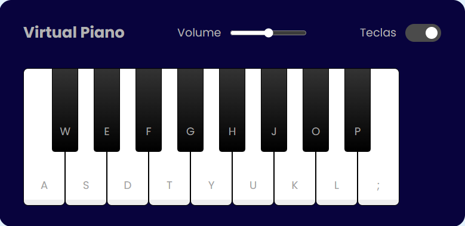

# 🎹 PIANO VIRTUAL 🎹

_Projeto de um piano virtual acionado tanto por cliques quanto pelas teclas do computador!_

Neste repositório você encontrará um divertido piano virtual para poder compor músicas, enviar para o Ximbinha e formar com ele a nova Banda Calipso. Você vai estourar na primeira composição! Certeza! 🤣

###  💻 Tecnologias Utilizadas:
- HTML e CSS para estruturação e estilização!
- JavaScript para a lógica de programação e interatividade com o piano tanto via clique do mouse quanto pelas teclas do computador!

###  🏢 Funcionalidades:
- _Tocando com o Cursor do Mouse:_ Toque o piano clicando diretamente nas teclas com o cursor do mouse
- _Tocando com as Teclas do Computador:_ Para tocar o piano de forma alternativa usando as teclas do computador, ative a caixa de seleção "Teclas" no canto superior direito do desenho do piano. As letras aparecerão automaticamente nas teclas do piano!
- _Controle do Volume:_ Controle o volume do piano através do slider "Volume" no centro do desenho do piano.

###   🎹 Como Tocar o Piano:
1. Execute um "git clone" em sua máquina para clonar este repositório para ela e ter uma cópia disponível
2. Dentro do repositório clonado, clique duas vezes no arquivo _index.html_ para abri-lo automaticamente em seu navegador padrão ou, com o botão direito encima do arquivo citado, selecione para executá-lo com o navegador de sua preferância
3. Use o ponteiro do mouse ou as teclas do computador (vide sessão _Funcionalidades_) para acionar o som do piano e compor canções para o Ximbinha 😆

###  Contribuições:
Sinta-se a vontade para contribuir e sugerir alterações por meio do _pull request_!

###  Créditos:
Este projeto foi desenvolvido durante o Bootcamp Potência Tech IFood, promovido pela instituição de ensino Digital Innovation One, sob a tutoria do professor Felipe Silva Aguiar (https://github.com/felipeAguiarCode).

 👋 Até mais e boas composições! See you latter!

